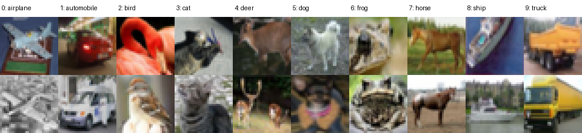

# Контролируемый набор данных: CIFAR-10

## Краткое решение

Для исследования неравномерности данных между клиентами выбран **CIFAR-10** (`uoft-cs/cifar10`). Контролируемый сценарий — синтетический перекос распределения меток, создаваемый распределением Дирихле по метке класса. Значение по умолчанию — `alpha = 0.5`, то есть умеренная неоднородность. IID-разбиение остаётся контрольной точкой.

Оригинальный CIFAR-10 содержит 60 000 цветных изображений `32 × 32` в 10 классах: 50 000 объектов в обучающей части и 10 000 — в тестовой. Каждый класс представлен ровно 6 000 объектами. Классы: самолёт (`airplane`), автомобиль (`automobile`), птица (`bird`), кошка (`cat`), олень (`deer`), собака (`dog`), лягушка (`frog`), лошадь (`horse`), корабль (`ship`) и грузовик (`truck`).

Источники:

- [официальная страница CIFAR-10 Университета Торонто](https://www.cs.toronto.edu/~kriz/cifar.html);
- [используемая карточка набора данных `uoft-cs/cifar10`](https://huggingface.co/datasets/uoft-cs/cifar10);
- [документация Flower `DirichletPartitioner`](https://flower.ai/docs/datasets/ref-api/flwr_datasets.partitioner.DirichletPartitioner.html).

## Почему он подходит для задачи

1. **Исходный баланс классов.** В обучающей выборке имеется по 5 000 изображений каждого класса. Поэтому наблюдаемый дисбаланс клиентов создаётся выбранным разбиением, а не скрытым глобальным дисбалансом исходных данных.
2. **Удобный перекос распределения меток.** Десяти классов достаточно, чтобы часть клиентов получила преимущественно 1–3 класса, а качество редких для клиента классов можно было измерить через макро-F1 и матрицу ошибок.
3. **Разумный вычислительный размер.** 50 000 обучающих объектов позволяют провести матрицу запусков с несколькими алгоритмами и начальными значениями генератора без ресурсов, необходимых для крупных наборов изображений.
4. **Сопоставимость.** CIFAR-10 широко применяется как контролируемый эталонный набор для классификации, а Flower Datasets напрямую поддерживает его загрузку и разбиение.
5. **Совместимость с проектом.** CNN принимает RGB-изображения `32 × 32` и выдаёт 10 классов. Смена набора не требует одновременно менять архитектуру, поэтому влияние non-IID-разбиения не смешивается с влиянием новой модели.
6. **Чистая глобальная оценка.** Официальная тестовая выборка остаётся централизованной и никогда не попадает в локальное обучение. Между клиентами распределяется только обучающая выборка.

## Примеры исследуемой неравномерности

При разбиении Дирихле для каждого класса случайно определяется доля объектов, передаваемая каждому клиенту. Чем меньше `alpha`, тем сильнее распределения клиентов отличаются друг от друга.

| Сценарий | Параметр | Назначение |
|---|---:|---|
| IID | — | контрольный базовый уровень с близким распределением классов у клиентов |
| Дирихле | `alpha = 1.0` | слабая неоднородность |
| Дирихле | `alpha = 0.5` | умеренная неоднородность, основной сценарий |
| Дирихле | `alpha = 0.1` | сильная неоднородность и выраженный дрейф клиентов |

Два воспроизводимых изображения каждого класса (начальное значение генератора — 42):



В реализации установлено `self_balancing=False`. Поэтому сценарий с распределением Дирихле моделирует не только перекос распределения меток, но и сопутствующий перекос объёмов данных: итоговое число объектов у клиентов может отличаться. Минимум в 50 объектов защищает эксперимент от случайно пустых или практически пустых клиентов.

Скрипт сохраняет два численных индикатора:

- `mean_normalized_label_entropy`: средняя нормированная энтропия меток клиента; значение около 1 означает близкую к равномерной смесь классов, меньшее значение — более сильный перекос распределения меток;
- `quantity_coefficient_of_variation`: коэффициент вариации размера клиентских частей; 0 означает одинаковое количество объектов.

Для сравнительных экспериментов используется более полный анализатор:

```bash
python scripts/analyze_heterogeneity.py \
  --dataset cifar10 --dataset-root data/cifar10 \
  --partitioner dirichlet \
  --dirichlet-alpha 0.5 --num-clients 10 --seed 42
```

Он записывает все сценарии в `results/heterogeneity_metrics.csv`: глобальные
entropy/Gini/QCID, количественные CV/Gini/Jain, клиентские и попарные
Jensen–Shannon/Hellinger/total variation, сглаженный KL, покрытие и отсутствие
классов. Метрики считаются на том же объекте разбиения, который использует
обучение, до локального train/validation split.

Wasserstein для номинальных классов требует явно заданной геометрии. Основным
вариантом выбран категориальный ground cost `0/1`; такой Wasserstein-1 равен
total variation и инвариантен к перенумерации классов. Значение по числовым
индексам меток экспортируется только с префиксом `diagnostic_`.

Фактически созданные примеры для 10 клиентов и начального значения генератора 42 подтверждают рост неоднородности:

| Сценарий | Минимум / максимум объектов клиента | Средняя энтропия меток | Коэффициент вариации количества |
|---|---:|---:|---:|
| IID | 5 000 / 5 000 | 0,9997 | 0,0000 |
| Дирихле `alpha=1.0` | 3 087 / 7 209 | 0,8598 | 0,2444 |
| Дирихле `alpha=0.5` | 1 560 / 7 754 | 0,7384 | 0,4280 |
| Дирихле `alpha=0.1` | 526 / 14 604 | 0,3733 | 0,7304 |

Например, при `alpha=0.5` клиент 1 не получил ни одного изображения класса truck, а у клиента 3 преобладают cat и dog. Полная таблица находится в [`dataset_examples/dirichlet_alpha_0_5_distribution.csv`](dataset_examples/dirichlet_alpha_0_5_distribution.csv), визуализация — в [`dataset_examples/dirichlet_alpha_0_5_distribution.png`](dataset_examples/dirichlet_alpha_0_5_distribution.png). Все точные параметры и сводные показатели сохранены в [`partition_summary.json`](dataset_examples/partition_summary.json).

## Загрузка и воспроизводимость

Правильнее не добавлять все 60 000 изображений в Git. Код загружает
`uoft-cs/cifar10` через Hugging Face Datasets и сохраняет локальный
`DatasetDict`, пригодный для автономных запусков. Достаточно один раз выполнить
из каталога `quickstart-pytorch`:

```bash
python scripts/prepare_cifar10.py
```

Скрипт:

- загружает CIFAR-10 и сохраняет его в `data/cifar10`;
- создаёт изображение с двумя примерами каждого из 10 классов;
- строит IID-разбиение и три разбиения Дирихле для 10 клиентов;
- сохраняет таблицы `client_id,total_samples,class_0,...,class_9`;
- сохраняет тепловую карту каждого распределения и сводный JSON-файл.

Артефакты создаются в `dataset_examples/`. Другие параметры можно задать явно:

```bash
python scripts/prepare_cifar10.py \
  --num-clients 20 \
  --alphas 1.0 0.5 0.1 \
  --seed 42 \
  --output-dir dataset_examples
```

Во время федеративного запуска те же параметры читаются из `pyproject.toml`. По умолчанию включён основной сценарий:

```toml
dataset = "cifar10"
partitioner = "dirichlet"
dirichlet-alpha = 0.5
dirichlet-min-partition-size = 50
validation-ratio = 0.2
seed = 42
```

Контрольный IID-запуск и два других уровня неоднородности:

```bash
flwr run . --run-config "partitioner='iid' seed=42" --stream
flwr run . --run-config "partitioner='dirichlet' dirichlet-alpha=1.0 seed=42" --stream
flwr run . --run-config "partitioner='dirichlet' dirichlet-alpha=0.1 seed=42" --stream
```

## Ограничения выбора

- Низкое разрешение и небольшой размер CIFAR-10 упрощают эксперимент и не отражают полностью реальные промышленные данные.
- Неравномерность создаётся синтетически; она контролируема и воспроизводима, но не моделирует все причины различий реальных пользователей.
- Глобальный баланс CIFAR-10 удобен для чистого эксперимента, однако отдельное исследование исходно несбалансированных данных потребует другого набора данных.
- В карточке Hugging Face поле лицензии не заполнено. Для академического использования следует сослаться на оригинальный технический отчёт Alex Krizhevsky, указанный на официальной странице CIFAR.

CIFAR-100 представляет более сложный вариант контролируемого эталонного набора: большее число классов усиливает перекос распределения меток, но требует изменить выходной слой модели и увеличивает стоимость серии экспериментов.

Серия с **естественным глобальным дисбалансом** использует HAM10000. Его описание, Kaggle-загрузка и команды запуска находятся в [HAM10000.md](HAM10000.md).
